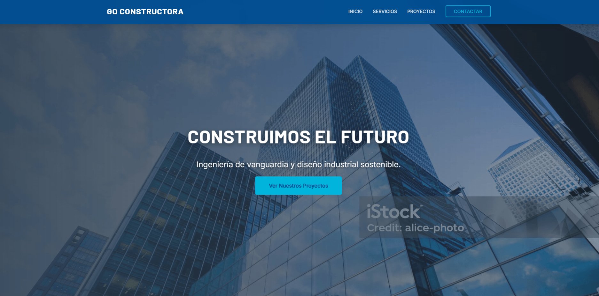

# 🏗️ GO Constructora - Web Corporativa

<p align="center">
  
</p>

<p align="center">
    
    
    
</p>

---

Landing page corporativa moderna desarrollada para una empresa de construcción e ingeniería. El proyecto se aleja de las plantillas tradicionales, enfocándose en una identidad visual tecnológica ("Ingeniería Corporativa"), alto rendimiento y una experiencia de usuario fluida adaptada a todos los dispositivos.

## 🚀 Demo Online

Puedes ver el proyecto funcionando aquí:

### 👉 [**Ver Web en Vercel**](https://web-corporativa-constructora.vercel.app)

---

## 🎨 Diseño y Características Visuales

Se desarrolló una identidad visual propia para transmitir confianza y modernidad.

- **Paleta de Colores "Ingeniería":**
  - **Azul Profundo (`#004e92`):** Seriedad y solidez corporativa.
  - **Cian Vibrante (`#00b4db`):** Tecnología, innovación y futuro.
- **Tipografía Técnica:** Combinación de **Barlow** (Títulos robustos) e **Inter** (Lectura optimizada).
- **Experiencia de Usuario (UX):**
  - **Scroll Reveal:** Aparición suave de secciones al navegar.
  - **Contadores Dinámicos:** Animación numérica en tiempo real para estadísticas.
  - **Micro-interacciones:** Feedback visual en botones y campos de formulario.
  - **Texturas:** Fondo con efecto "marca de agua" de planos de ingeniería.
- **Diseño 100% Responsive:** Layout fluido que se adapta desde pantallas 4K hasta móviles, incluyendo un menú hamburguesa personalizado.

## 🛠️ Stack Tecnológico

Este proyecto evita el uso de frameworks pesados para garantizar el máximo rendimiento y control sobre el código.

- **HTML5 Semántico:** Estructura optimizada para accesibilidad y SEO.
- **SASS (SCSS):** Arquitectura modular escalable (patrón 7-1 simplificado), uso de variables globales, mixins para media queries y anidamiento.
- **JavaScript (Vanilla ES6+):** Lógica del menú móvil, observadores de intersección (para animaciones al scroll) y contadores, sin dependencias externas.
- **CSS Moderno:** Uso extensivo de CSS Grid y Flexbox para layouts complejos.

## 📂 Estructura del Proyecto

El código está organizado para ser mantenible y escalable:

```text
/
├── css/
│   └── main.css       # CSS final compilado para producción
├── img/               # Recursos gráficos, capturas y Favicon
├── scss/              # Código fuente SASS
│   ├── base/          # Variables globales, resets y mixins
│   ├── components/    # Módulos UI (Navbar, Botones, Tarjetas, Forms)
│   ├── layout/        # Estructuras mayores (Header, Footer, Secciones)
│   └── main.scss      # Archivo maestro importador
├── index.html         # Maquetado principal
├── web.js             # Lógica de interacción JS
└── README.md          # Documentación
```
